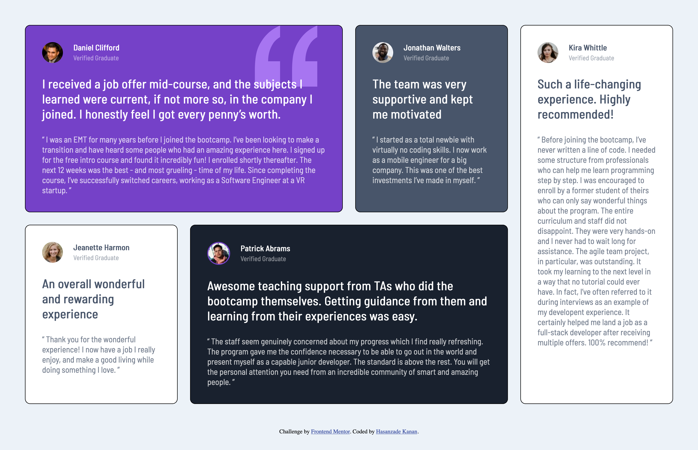

# Frontend Mentor - Testimonials grid section solution

This is a solution to the [Testimonials grid section challenge on Frontend Mentor](https://www.frontendmentor.io/challenges/testimonials-grid-section-Nnw6J7Un7). Frontend Mentor challenges help you improve your coding skills by building realistic projects. 

## Table of contents

- [Overview](#overview)
  - [The challenge](#the-challenge)
  - [Screenshot](#screenshot)
  - [Links](#links)
- [My process](#my-process)
  - [Built with](#built-with)
  - [What I learned](#what-i-learned)
- [Author](#author)

## Overview

### The challenge

Users should be able to:

- View the optimal layout for the site depending on their device's screen size

### Screenshot




### Links

- Solution URL: [GitHub](https://www.github.com/KananHasanov747)
- Live Site URL: [Add live site URL here](https://your-live-site-url.com)

## My process

### Built with

- Semantic HTML5 markup
- CSS custom properties
- Flexbox
- CSS Grid
- font-family [Barlow Semi Condensed](https://fonts.google.com/specimen/Barlow+Semi+Condensed)

### What I learned

I learned how to use the grid property, like `grid-auto-columns` to specify the size of implicitly created columns at the same fraction (`1fr`), and `grid-template-areas`, which helped me to specify named grid areas, establishing the cells in the grid and assigning them names.

```css
.testimonial-grid {
    display: grid;
    gap: 1.5rem;

    grid-auto-columns: 1fr;
    grid-template-areas: 
        'one' 'two' 'three' 'four' 'five';
}

@media (min-width: 710px) {
    .testimonial-grid {
        grid-template-areas:
            'one one'
            'two five'
            'three five'
            'four four';
    }
}

@media (min-width: 900px) {
    .testimonial-grid {
        grid-template-areas:
            'one one two five'
            'three four four five';
    }
}

.testimonial-1 { grid-area: one; }
.testimonial-2 { grid-area: two; }
.testimonial-3 { grid-area: three; }
.testimonial-4 { grid-area: four; }
.testimonial-5 { grid-area: five; }
```

## Author

- Frontend Mentor - [@yourusername](https://www.frontendmentor.io/profile/KananHasanov747)
- Twitter - [@1Kanan1](https://twitter.com/KananHasanzade4)